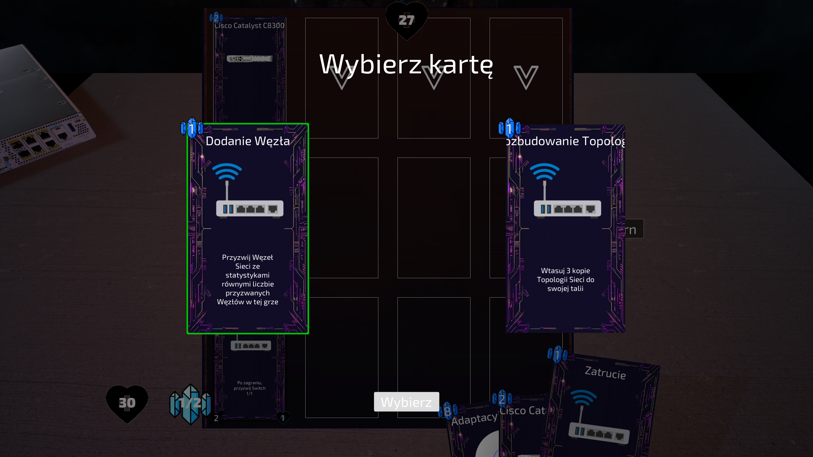
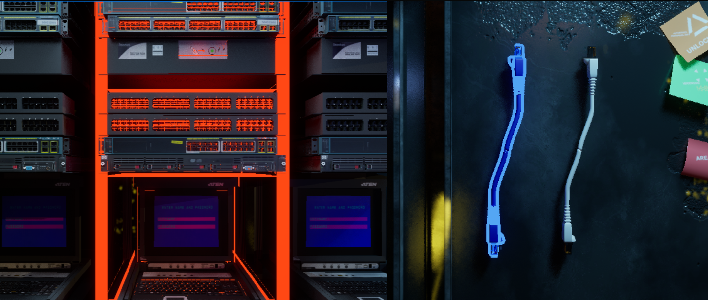
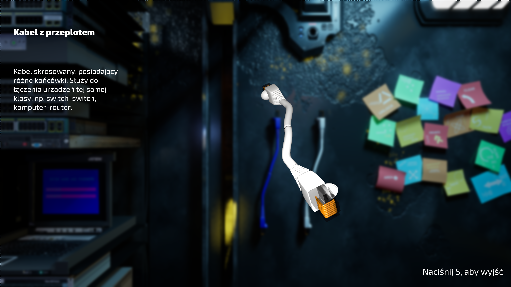
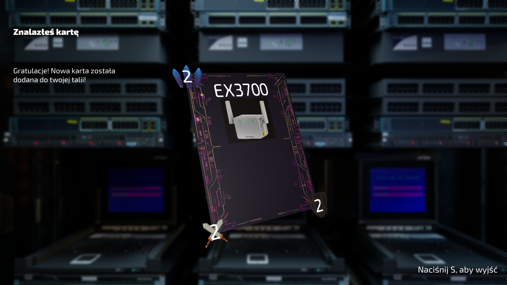
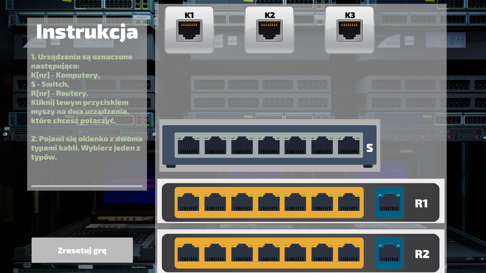
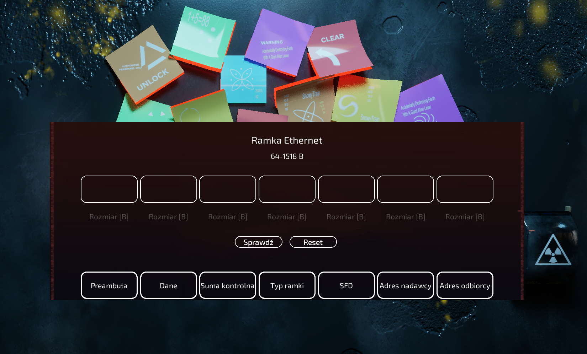

# Network Interface Card Game

## Authors

- [Jan Ciężkowski](https://github.com/jciezkowski)
- [Krzysztof Mach](https://github.com/MadMach420)
- [Kacper Słoniec](https://github.com/Kasl0)

Supervised by: Dr. Eng. Sławomir Zieliński

---

## Project Overview

This repository contains the source code and resources for an educational card game designed to support self-directed learning in computer networking. The project is part of an engineering thesis titled **"Supporting Self-Education Through a Card Game"**. The game combines gameplay mechanics with educational elements to make learning engaging and interactive.

---

## Features

- **Single-player Campaign**: Engage in card battles while exploring computer networking topics.
- **Quizzes**: Test your knowledge with interactive questions that directly impact gameplay.
- **Exploration Mode**: Discover in-game objects and mini-games to enhance learning.
- **Personality Analysis**: The game classifies players according to Bartle's taxonomy based on their gameplay style.

---

## Installation

To run the game on your computer, follow these steps:

1. Download the latest game package from the releases page on GitHub. Choose the package prepared for your operating system (e.g., NICGameWindows for Windows systems). Click on the selected `.zip` package to save it to your computer.

   > Link to the releases page: [GitHub Releases](https://github.com/Kasl0/Network_Interface_Card_Game/releases)

2. After downloading the archive, extract it:
   - Right-click on the package and select the appropriate option to extract all files. Wait until the extraction process completes.

3. Navigate to the extracted game directory, then choose the folder matching your operating system. Inside, you will find the game files.

4. To run the game:
   - Double-click the executable file (with a `.exe` extension for Windows) located in the folder.

5. (Optional) To simplify the process of launching the game in the future, you can create a shortcut:
   - Right-click on the executable file and select "Create Shortcut". Move the created shortcut to any location on your computer, such as the desktop.

## Screenshots

